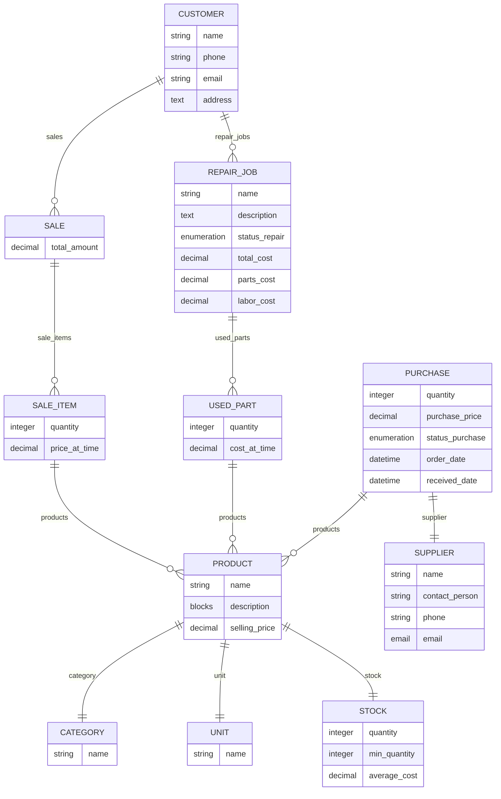

## คำอธิบาย

**1. CATEGORY**

* **attributes**

  * `name` (string, ข้อมูลจำเป็น)
* **ความสัมพันธ์**

  * ไม่มีฝั่ง inverse ใน schema นี้ แต่แต่ละ `PRODUCT` จะชี้ไปยัง `CATEGORY` ผ่านความสัมพันธ์ one-to-one (`PRODUCT.category`)

---

**2. CUSTOMER**

* **attributes**

  * `name` (string, จำเป็น)
  * `phone` (string, ไม่จำเป็น)
  * `email` (email, ไม่จำเป็น)
  * `address` (text, ไม่จำเป็น)
* **ความสัมพันธ์**

  * **หนึ่งลูกค้า (1 CUSTOMER) สร้างได้หลายใบซ่อม (N REPAIR\_JOB)**

    * แท็กความสัมพันธ์: `repair_jobs` (one-to-many)
  * **หนึ่งลูกค้า (1 CUSTOMER) มีหลายการขาย (N SALE)**

    * แท็กความสัมพันธ์: `sales` (one-to-many)

---

**3. PRODUCT**

* **attributes**

  * `name` (string, จำเป็น)
  * `description` (blocks, ไม่จำเป็น)
  * `selling_price` (decimal, จำเป็น)
* **ความสัมพันธ์**

  * **แต่ละสินค้า (PRODUCT) มีหมวดหมู่หนึ่ง (CATEGORY)**

    * one-to-one (`category`)
  * **แต่ละสินค้า (PRODUCT) มีหน่วยนับหนึ่ง (UNIT)**

    * one-to-one (`unit`)
  * **แต่ละสินค้า (PRODUCT) มีสต็อกหนึ่ง (STOCK)**

    * one-to-one แบบสองทิศทาง (`stock`)

---

**4. PURCHASE**

* **attributes**

  * `quantity` (integer, จำเป็น)
  * `purchase_price` (decimal, จำเป็น)
  * `status_purchase` (enumeration, จำเป็น)
  * `order_date` (datetime, ไม่จำเป็น)
  * `received_date` (datetime, ไม่จำเป็น)
* **ความสัมพันธ์**

  * **หนึ่งใบสั่งซื้อ (1 PURCHASE) เกี่ยวข้องกับสินค้าหลายรายการ (N PRODUCT)**

    * one-to-many (`products`)
  * **หนึ่งใบสั่งซื้อ (1 PURCHASE) มาจากผู้จัดส่งหนึ่ง (1 SUPPLIER)**

    * one-to-one (`supplier`)

---

**5. REPAIR\_JOB**

* **attributes**

  * `name` (string, จำเป็น)
  * `description` (text, ไม่จำเป็น)
  * `status_repair` (enumeration, จำเป็น)
  * `total_cost` (decimal, จำเป็น)
  * `parts_cost` (decimal, ไม่จำเป็น)
  * `labor_cost` (decimal, ไม่จำเป็น)
* **ความสัมพันธ์**

  * **การซ่อมหนึ่งรายการ (1 REPAIR\_JOB) ดำเนินการให้ลูกค้าหนึ่ง (1 CUSTOMER)**

    * many-to-one (`customer`)
  * **การซ่อมหนึ่งรายการ (1 REPAIR\_JOB) มีอะไหล่ที่ใช้หลายรายการ (N USED\_PART)**

    * one-to-many (`used_parts`)

---

**6. SALE**

* **attributes**

  * `total_amount` (decimal, จำเป็น)
* **ความสัมพันธ์**

  * **การขายหนึ่งรายการ (1 SALE) เกิดจากลูกค้าหนึ่ง (1 CUSTOMER)**

    * many-to-one (`customer`)
  * **การขายหนึ่งรายการ (1 SALE) แยกออกเป็นหลายรายการย่อย (N SALE\_ITEM)**

    * one-to-many (`sale_items`)

---

**7. SALE\_ITEM**

* **attributes**

  * `quantity` (integer, จำเป็น)
  * `price_at_time` (decimal, ไม่จำเป็น)
* **ความสัมพันธ์**

  * **แต่ละ sale\_item เชื่อมกับการขายหนึ่งรายการ (1 SALE)**

    * many-to-one (`sale`)
  * **แต่ละ sale\_item อาจเกี่ยวข้องกับสินค้าหลายรายการ (N PRODUCT)**

    * one-to-many (`products`)

---

**8. STOCK**

* **attributes**

  * `quantity` (integer, ไม่จำเป็น)
  * `min_quantity` (integer, ไม่จำเป็น)
  * `average_cost` (decimal, ไม่จำเป็น)
* **ความสัมพันธ์**

  * **สต็อกหนึ่ง (1 STOCK) เก็บข้อมูลสำหรับสินค้าเดียว (1 PRODUCT)**

    * one-to-one (`product`)

---

**9. SUPPLIER**

* **attributes**

  * `name` (string, จำเป็น)
  * `contact_person` (string, ไม่จำเป็น)
  * `phone` (string, ไม่จำเป็น)
  * `email` (email, ไม่จำเป็น)
* **ความสัมพันธ์**

  * **เชื่อมกับการสั่งซื้อ (PURCHASE) แบบ one-to-one**

---

**10. UNIT**

* **attributes**

  * `name` (string, จำเป็น)
* **ความสัมพันธ์**

  * **เชื่อมกับสินค้า (PRODUCT) แบบ one-to-one**

---

**11. USED\_PART**

* **attributes**

  * `quantity` (integer, จำเป็น)
  * `cost_at_time` (decimal, ไม่จำเป็น)
* **ความสัมพันธ์**

  * **อะไหล่ที่ใช้แต่ละรายการ (1 USED\_PART) เป็นส่วนหนึ่งของการซ่อมหนึ่งรายการ (1 REPAIR\_JOB)**

    * many-to-one (`repair_job`)
  * **อะไหล่ที่ใช้หนึ่งรายการ (1 USED\_PART) อาจเชื่อมกับสินค้าหลายรายการ (N PRODUCT)**

    * one-to-many (`products`)

---

> 🌟 อธิบายภาพรวม:
>
> * เรามี **11 Entity** หลัก ครอบคลุมตั้งแต่ข้อมูลลูกค้า, สินค้า, การขาย, การสั่งซื้อ, งานซ่อม, จนถึงอะไหล่ที่ใช้
> * ใช้ **mermaid ER Diagram** เพื่อแสดงความสัมพันธ์ (cardinality) ระหว่าง Entity แต่ละตัว
> * คำอธิบายแต่ละ Entity เขียนอย่างละเอียด ตั้งแต่ชนิดข้อมูล (type) ว่าจำเป็นหรือไม่ ถึงขอบเขตความสัมพันธ์
